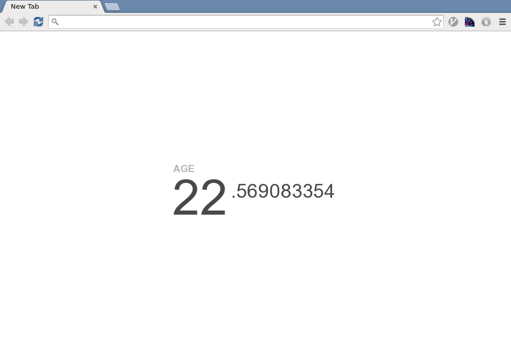

Motivation
========

Your age.

## Usage

### Age
Enter birthday on first use to see age.

### Bookmarks
Displays vertical view of bookmarks in the top right corner.

To select a bookmark either click or focus on the page and press the key (0-9)
of the the number to the left of the bookmark.
_Note: focusing the page is shift-tab in my browser (chrome on linux)._

## TODO (reasons for forking)

- [x] ~~Fix wiggling back and forth of age.~~
- [ ] Add some sort of access to bookmarks
    - [x] Display clickable shortcuts with favicons
    - [x] Add hotkeys to open shortcuts
    - [ ] Support numberpad numbers
    - [ ] Support more than 10 bookmarks
    - [ ] Add ability to navigate down into bookmark folders
    - [x] Add ability to "open all bookmarks" in a folder
    - [ ] Make bookmark display/permissions optional

Fork of [maccman/motivation](https://github.com/maccman/motivation)
