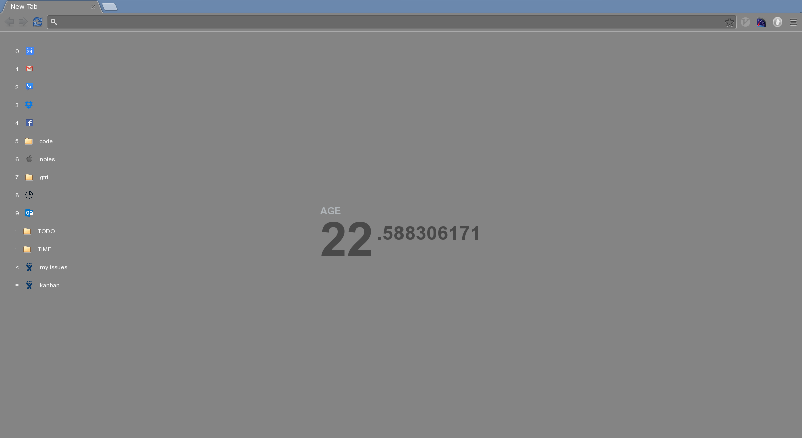

Motivation
========

Your age.

[Link to extension in chrome web store](https://chrome.google.com/webstore/detail/motivation-devm33-fork/edaphnidncfdooaldnhdmijjephlbehh)

## Usage

### Age
Enter birthday on first use to see age.

### Bookmarks
Displays vertical view of bookmarks in the top right corner.

To select a bookmark either click or focus on the page and press the key
of the the number to the left of the bookmark.
*Note: focusing the page is just tab in my browser (chrome on linux).*

All bookmarks in a folder can also be opened by middle clicking the folder,
presing spacebar before pressing the folder's key, or using the bookmark in
position 0 to open all for the current folder.

Right clicking on bookmarks displays a context menu with the option to delete
the bookmark.

## TODO (reasons for forking)

- [x] Fix wiggling back and forth of age text
- [ ] Add optional access to bookmarks
    - [x] Display clickable shortcuts with favicons
    - [x] Add hotkeys to open shortcuts
    - [x] Support more than 10 bookmarks
    - [x] Add navigatng down into bookmark folders
    - [x] Add "open all bookmarks" in a folder
    - [ ] Make up-one-level use up arrow
    - [ ] Add editing
    - [ ] Add dragging to reorder bookmarks
    - [ ] Listen to all changes of bookmarks and update, live!
    - [ ] Make bookmark display/permissions optional (via settings)
- [ ] Add settings to change colors of background, text, etc.
- [ ] Persist settings and age across devices using storage api

Fork of [maccman/motivation](https://github.com/maccman/motivation)
